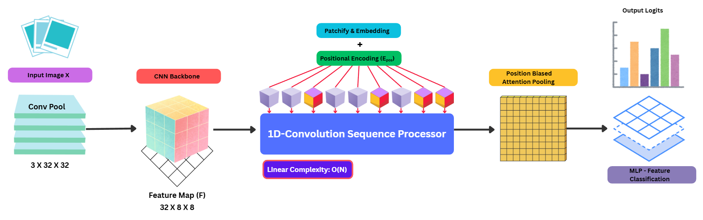
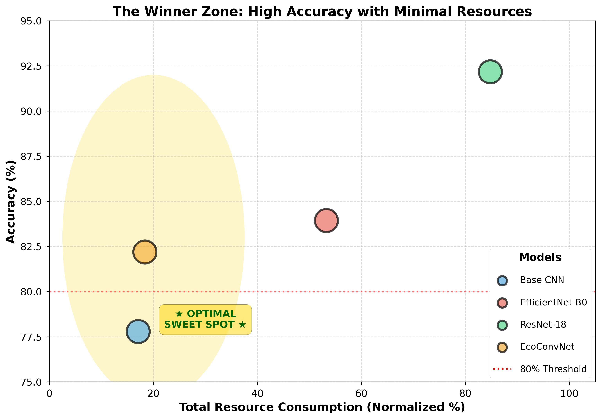
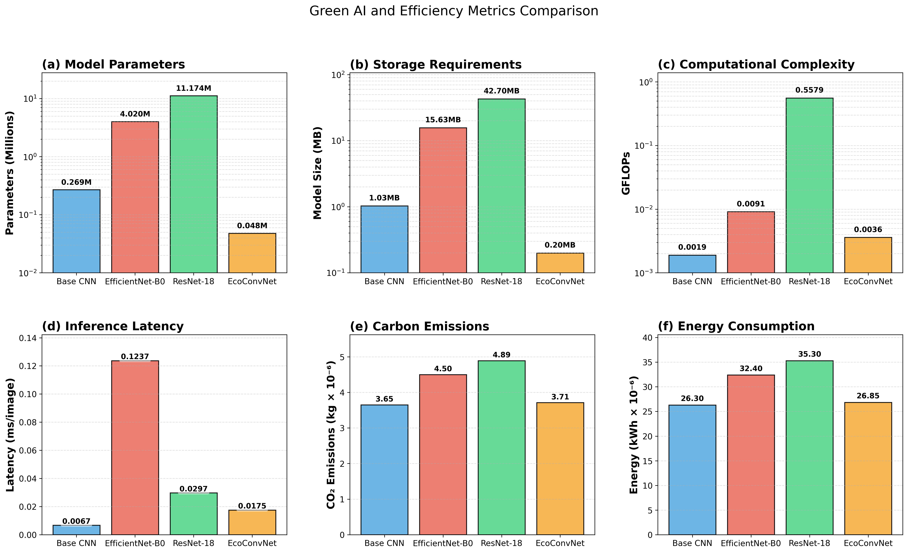
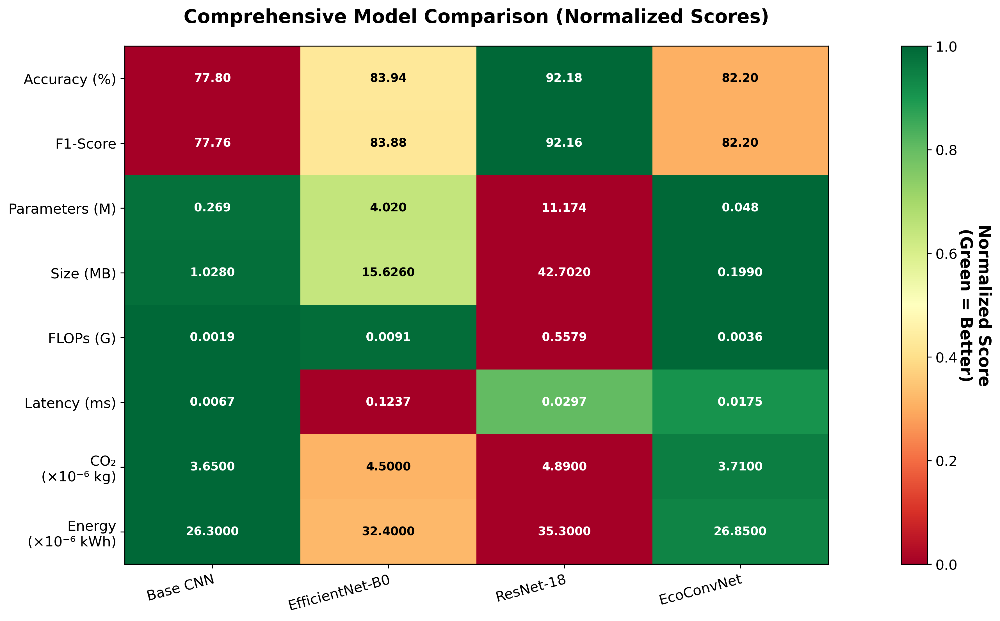

<div align="center">
  <h1>EcoConvNet (Leaf-Net)</h1>
  <p><strong>Beyond Self-Attention: Designing Lightweight Transformer-Like Models with 1D-Convolutions for Green AI</strong></p>

  <p>
    <a href="https://github.com/kingknight07/Leaf-net/actions"></a>
    <a href="https://pypi.org/project/leaf-net/"></a>
    <a href="https://github.com/kingknight07/Leaf-net/blob/main/LICENSE"></a>
    <a href="https://huggingface.co/models?search=leaf-net"></a>
    <a href="https://www.python.org/"></a>
  </p>
</div>

<hr />

## Overview

The increasing computational demands of modern deep learning models, particularly Transformers, present a significant challenge to the goal of sustainable, or "Green," AI. While hybrid architectures have advanced computer vision, their core self-attention mechanisms remain a major source of parameter and computational inefficiency. 

This repository provides the official implementation of **EcoConvNet** (distributed as `leaf-net`), a novel and lightweight Transformer-like architecture meticulously designed for energy-efficient computer vision. The central innovation of our model is the replacement of the canonical Multi-Head Self-Attention block with a highly efficient sequence processor built on temporal 1D-Convolutions. This design choice drastically reduces the model's complexity from quadratic to linear with respect to sequence length, leading to substantial gains in efficiency. 

We further enhance the architecture with a unique Positional-Biased Attention Pooling mechanism, a parameter-efficient module that integrates content-based feature importance with a learnable spatial bias. Through rigorous empirical evaluation, we demonstrate that EcoConvNet achieves a superior accuracy-per-FLOP trade-off compared to conventional baselines, providing a concrete design paradigm for developing next-generation Green AI models suitable for resource-constrained environments.

## Architecture

Our approach creates a synergistic balance between efficient local feature extraction and expressive global-like context aggregation. 

<div align="center">
  
  <p><em>Figure 1: The overall architectural blueprint of EcoConvNet. An input image is processed by a CNN backbone, patchified, and passed through our linear-time 1D-Convolutional Sequence Processor. The resulting sequence is aggregated by the Positional-Biased Attention Pooling layer before final classification.</em></p>
</div>

### Core Methodological Components:

1. **CNN Feature Extraction**: An input image first passes through a lightweight CNN backbone, which functions as a parsimonious hierarchical feature extractor.
2. **Patchification and Embedding**: The resulting feature map is partitioned into a uniform grid of non-overlapping patches. Learnable positional encodings are added to the sequence.
3. **1D-Convolutional Sequence Processing**: We replace quadratic-cost Multi-Head Self-Attention with a stack of temporal 1D-convolutional layers, modeling local relationships between adjacent patch embeddings with linear-time complexity $O(N \cdot D_{embed}^2 \cdot K)$.
4. **Positional-Biased Attention Pooling**: The processed sequence is intelligently aggregated into a single feature vector using a lightweight pooling mechanism that weighs patches based on both their dynamic content and static spatial position.

<div align="center">
  
  <p><em>Figure 2: Systematic workflow illustrating the transition from raw data to linearized sequence processing.</em></p>
</div>

## Performance and Sustainability Analysis

EcoConvNet occupies the Pareto Frontier for resource-constrained vision. It provides an exceptionally balanced profile, avoiding the extreme computational costs of deep residual networks and the architectural bloat of standard efficient models.

<div align="center">
  
  <p><em>Figure 3: Model Performance Comparison on CIFAR-10.</em></p>
</div>

Our sustainability analysis highlights that EcoConvNet's energy consumption is nearly 64 times lower than that of ResNet-18, and its parameter count is 84 times smaller than EfficientNet-B0 (0.048M vs. 4.020M parameters). In a real-world edge deployment scenario, this translates to a massive extension of battery life and a significant reduction in the operational carbon footprint.

<div align="center">
  
  <p><em>Figure 4: Green AI and Efficiency Metrics Comparison. Lower values represent better sustainability.</em></p>
</div>

## Installation

EcoConvNet requires Python `3.8+` and PyTorch `1.9+`. You can install the package directly from PyPI:

```bash
pip install leaf-net
```

For development and local testing:
```bash
git clone https://github.com/kingknight07/Leaf-net.git
cd Leaf-net
pip install -e .
```

## Usage

### 1. Model Initialization

You can dynamically instantiate EcoConvNet for any image resolution, patch size, and number of classes.

```python
import torch
from leaf_net import EcoConvNet

# Example: 3x128x128 input images, 5 target classes
model = EcoConvNet(
    img_size=(128, 128),
    patch_size=(4, 4),
    in_channels=3,
    num_classes=5
)

dummy_input = torch.randn(1, 3, 128, 128)
output = model(dummy_input)

print(f"Output shape: {output.shape}") 
# Expected Output: torch.Size([1, 5])
```

### 2. Custom Training

EcoConvNet integrates effortlessly into standard PyTorch training pipelines:

```python
import torch
import torch.nn as nn
import torch.optim as optim
from leaf_net import EcoConvNet, train_model

device = torch.device("cuda" if torch.cuda.is_available() else "cpu")
model = EcoConvNet(img_size=(32, 32), num_classes=10).to(device)
optimizer = optim.Adam(model.parameters(), lr=1e-3)
criterion = nn.CrossEntropyLoss()

# Assuming `train_loader` is defined
# history = train_model(model, device, train_loader, optimizer, criterion, epochs=10)
```

## Authors & Contributors

This research and implementation are the result of collaborative efforts by:

- **Ayush Shukla** (@kingknight07)
- **Ashutosh Kumar Singh**
- **Vijay Dwivedi**
- **Sulabh Sachan**
- **Iwona Grobelna**
- **Praveen Pratap Singh**

## Citation

If this architecture and methodology assist in your research on sustainable deep learning, please consider citing our work:

```bibtex
@incollection{shukla2026ecoconvnet,
  title={EcoConvNet: A Novel Lightweight Transformer like Architecture with 1D-Convolutions for Green AI Computer Vision},
  author={Shukla, Ayush and Singh, Ashutosh Kumar and Dwivedi, Vijay and Sachan, Sulabh and Grobelna, Iwona and Singh, Praveen Pratap},
  year={2026},
  note={Book Chapter}
}
```

## License

This project is released under the [Apache License 2.0](LICENSE). See the `LICENSE` file for more details.
